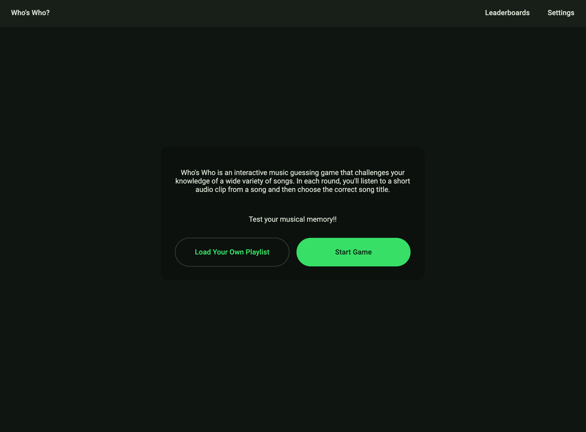
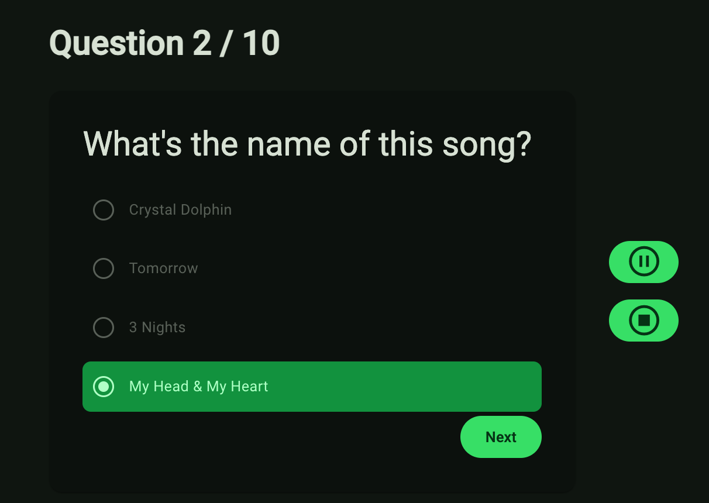
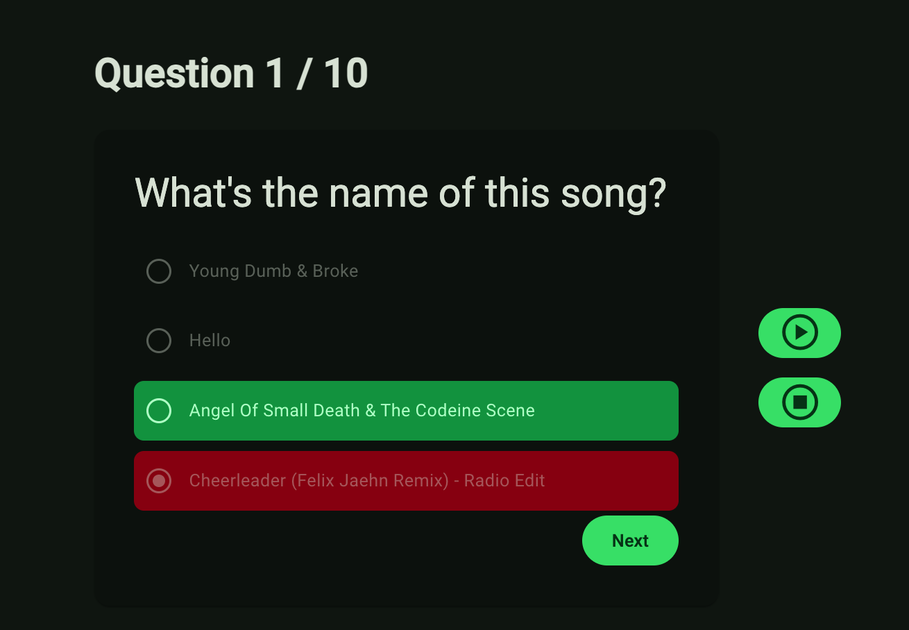
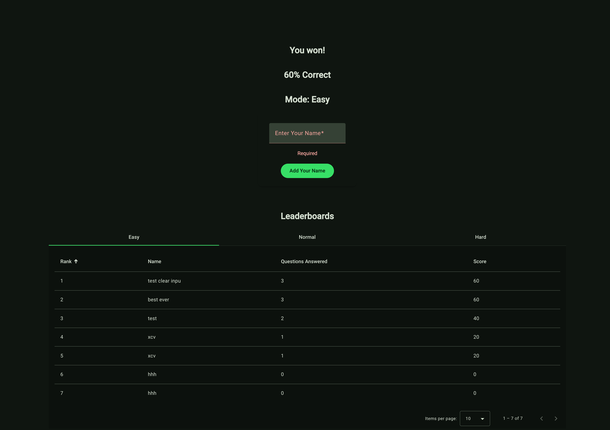
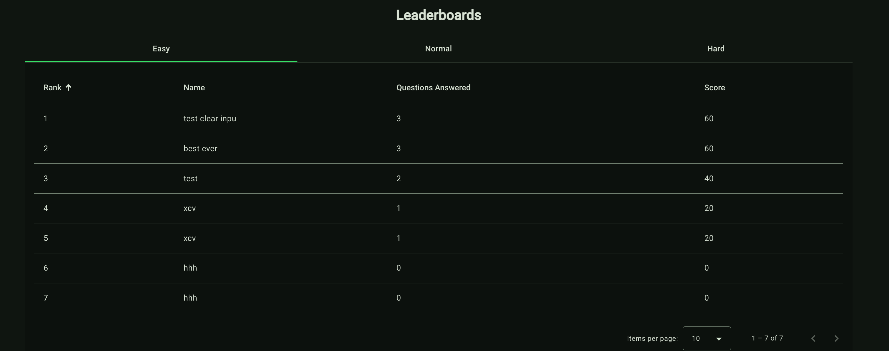
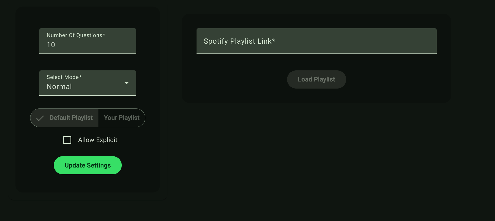

[Original Project Outline](OUTLINE.md)

<h1 align="center">Who's Who</h1>

*** Tea Time was previously deployed via Render and was taken down on Feb 27, 2024 ***

 

# Table of Contents
- [Flow of Application](#app-flow)
- [Tech & Tools Used](#tech-and-tools)
- [Contributors](#contributors)

# Tech and Tools

  #### Built With
  - 
  - 
  - 
  - 
 

# App Flow

  # Contributors

  <table  text-align: center;">
    <tr>
      <td ></td>
      <td></td>
    </tr>
  <tr>
    <td><strong>Mohamed Mohamed</strong></td>
    <td><strong>Yuji Kosakowski</strong></td>
  </tr>
  <tr>
    <td>
      
<a href="https://github.com/makmn1">GitHub</a> 
      <a href="https://www.linkedin.com/in/">LinkedIn</a>

    </td>
    <td>
      
<a href="https://github.com/Yuji3000">GitHub</a> 
      <a href="https://www.linkedin.com/in/yujikosa/">LinkedIn</a>

    </td>
  </tr>
</table>
